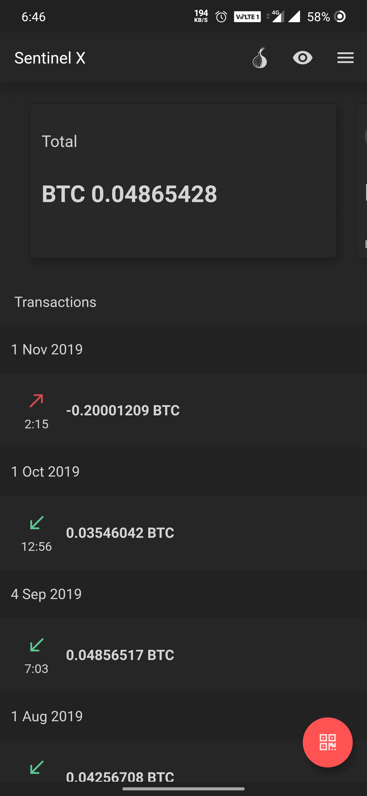
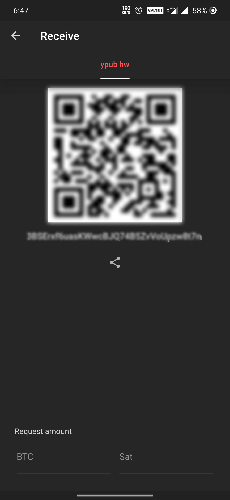
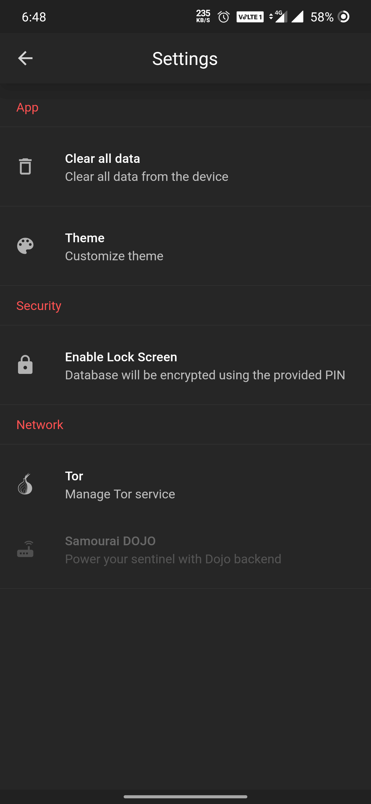
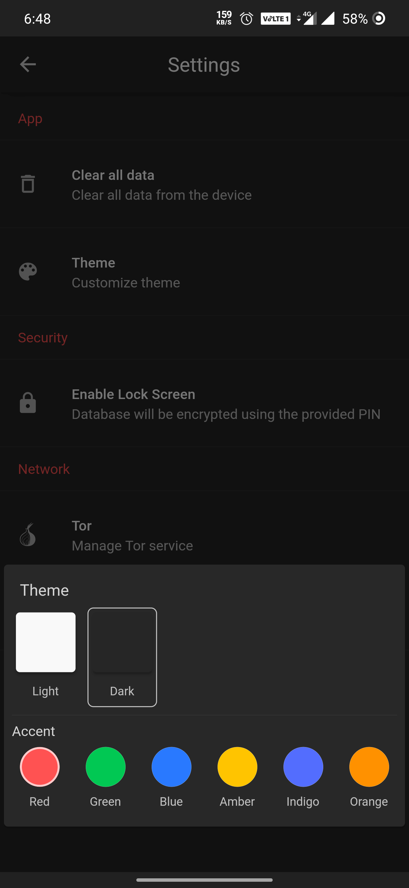
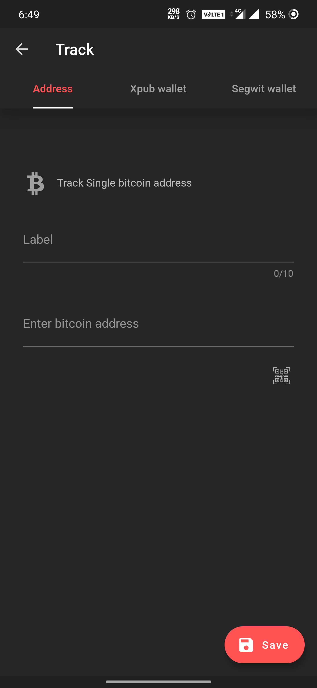
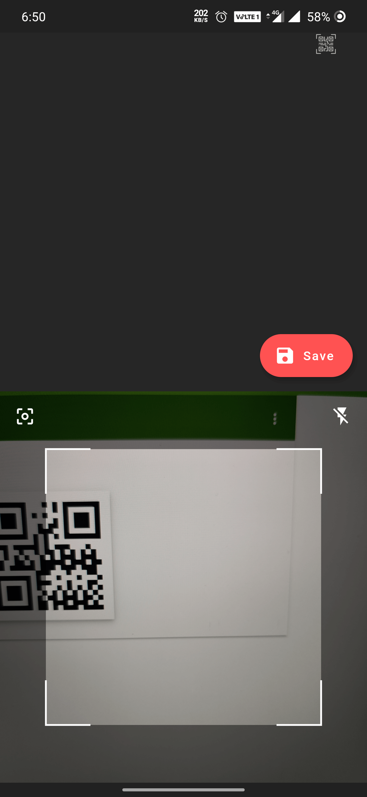
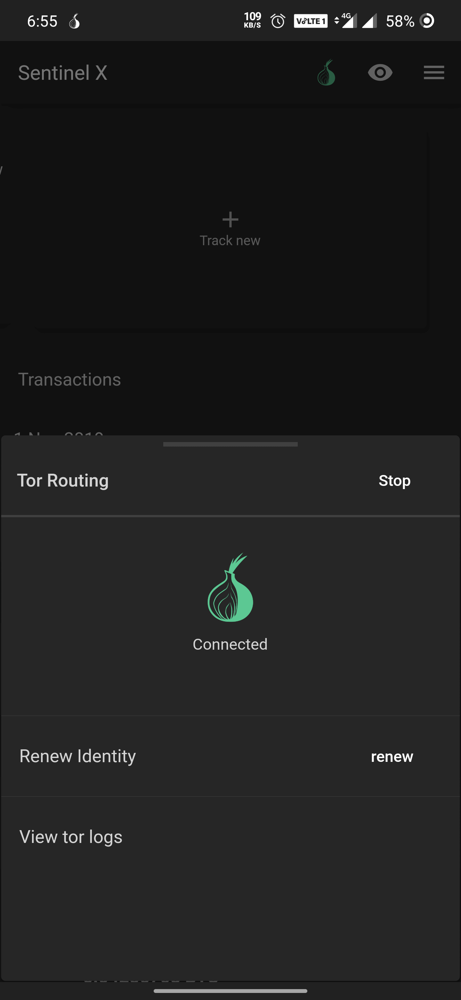
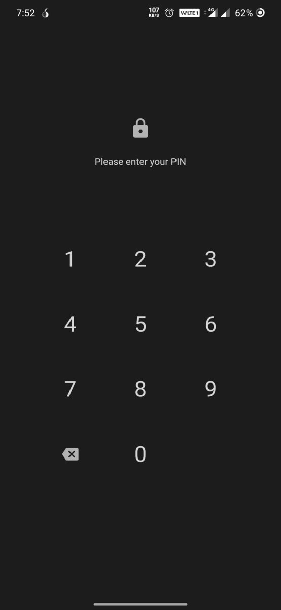

   

<h2 align="center">[BETA] Sentinel x</h2>

bitcoin watch only wallet based on <a href="https://github.com/Samourai-Wallet/sentinel-android"> samourai sentinel</a>
 

  <a href="https://github.com/InvertedX/sentinelx/releases">Download</a>
 

 
## Sentinel x Features

* Sleek and faster UI
* Tor Support
* Offline Mode
* Theme support (light/dark and accent)
* db level encryption
* Dojo node support

## Screenshots

<table>
<tr>
  <td style="text-align: center">
     </a>
</td>
<td style="text-align: center">
 
 </td>
<td style="text-align: center">
 
 </td>
  <td style="text-align: center">
   
   </td>
 </tr>
 <tr>
   <td style="text-align: center">
      </a>
 </td>
 <td style="text-align: center">
  
  </td>
 <td style="text-align: center">
  
  </td>
   <td style="text-align: center">
    
    </td>
  </tr>
 </table>
 

## Sentinel features

### BIP44:
Sentinel implementation based on [original BIP](https://github.com/bitcoin/bips/blob/master/bip-0044.mediawiki) ([bitcoin/bips:bip-0044.mediawiki@`master`](https://github.com/bitcoin/bips/blob/master/bip-0044.mediawiki)) extends [bitcoinj](https://bitcoinj.github.io/).

### BIP49 (Segwit):
Sentinel implementation based on [original BIP] ([bitcoin/bips:bip-0049.mediawiki@`master`](https://github.com/bitcoin/bips/blob/master/bip-0049.mediawiki)) by Daniel Weigl and includes support for BIP49-specific XPUBs: [YPUB](https://github.com/Samourai-Wallet/sentinel-android/issues/16).

### BIP84 (Segwit):
Sentinel implementation based on [original BIP](https://github.com/bitcoin/bips/blob/master/bip-0084.mediawiki) by Pavol Rusnak.

### BIP141 (Segwit):
Sentinel P2WPKH based on [original BIP](https://github.com/bitcoin/bips/blob/master/bip-0141.mediawiki) by Eric Lombrozo, Johnson Lau and Pieter Wuille.

### BIP173 (Segwit):
Sentinel implementation based on [original BIP](https://github.com/bitcoin/bips/blob/master/bip-0173.mediawiki) by Pieter Wuille and Greg Maxwell.

## Build

- Install [Flutter](https://flutter.dev/)  and its dependencies.
- Run the project by executing ``Flutter run``

------

[Note]:  Sentinel x does not support ios (for now)(since this app is completely based on sentinel-android, in order to support IOS we need to port/implement native calls in ios )

